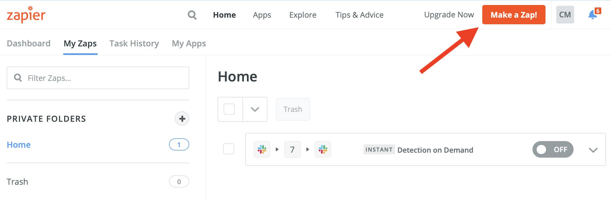

# Integrating via Zapier
Zapier is a web-based service that allows end users to integrate with the web applications they use without writing any code. Zapier can easily connect many applications that you use every day. This sample integration will show how you can use Zapier to connect FireEye's Detection on Demand service to an app. You can choose any application that Zapier offers to integrate with, but for this example we'll use Slack. Once you build the API POST and GET calls (shown later in this tutorial), you can replicate this process across all Zapier apps that make sense for you.

For this example, you'll need to be the owner of an existing Slack workspace.

<!-- Tell them about the requirements up front, so they aren't surprised later. -->

## Prerequisites
1. Create an account at [zapier.com](https://zapier.com).

## Creating your Trigger
2. Click the _Make a Zap!_ icon in the upper right hand side:

3. Under _Choose App & Event_ select the Slack application and then choose what event you want to trigger your Zap:

4. In this example, we'll choose the trigger _New File_. Click Continue.

> _Zapier will ask you to sign into your existing slack workspace. Select a channel that you want this Zap to work in. This must be a public channel._

5. After you choose your Slack account, click Continue.

6. For the _Customize File_ section, you do not need to do anything--just click Continue.

7. Now click _Test & Continue_. If there are no errors then you have successfully created your trigger. Next, you must create your action (the thing that happens after your trigger).

## Creating your POST Action
8. <!-- First sentence just repeated step 6 --> Now we'll send the new trigger to FireEye's Detection on Demand via a POST request. To do this, select "Webhooks by Zapier" as your app, which is just a way to call an external API. Choose "POST" as your action event, then click Continue.

9. Next we will configure the parameters that will be sent to the API. As in the image below, you'll enter the API URL (https://feapi.marketplace.apps.fireeye.com/files), the API Key, and additional parameters that are needed to send the file for analysis. Select the file to send from the dropdown menu.  If you don't see a file in the dropdown you will need to post one to your Slack channel so Zapier can find it.  This can be any file, malicious or benign.

 The section labeled "Data" is optional.  We will skip it in this example.

10. In the section labeled "File", click the option button on the text field and select the "File (Exists but not shown)" option.  See the images for the configuration details.

11. Now, you can test the POST request, assuming you have a sample file that you sent as an attachment in a Slack message. This file can be an actual malicious file, or a benign file.

Hopefully, your test is successful on the first attempt, but if not, you can troubleshoot based on the error messages returned and you can always go to the [FireEye Community](https://community.fireeye.dev) for additional help.

12. This step is a simple one, but is key to letting the API work its magic. Since it can take a few minutes to get a response, we need to build in a wait period before we check the results. Add a new step and select the "Delay by Zapier" app.

In this example, we set the delay to 3 minutes, which should give the file enough time to process. The API docs say the recommended time is to check every 90 seconds, so we double it to be safe.

13. Now, test it!

## Creating your GET Action
14. Now the fun begins ... let's see if your file is malicious! To do this, we'll have to repeat some previous steps, but this time we'll use a GET request to get the results. You can select the app _Webhooks by Zapier_ again. It should look like this:

15. Now, enter all of the configuration again (URL, API Key, parameters, etc). The screenshots below should get you to where you need to be.  The URL is https://feapi.marketplace.apps.fireeye.com/reports/.  Add the report ID path parameter to the URL by clicking the option button on the URL text field, selecting "POST", and selecting "Report ID" in the list.

16. Finally, you test it by running it against the file you submitted with the POST request. The results should look like this:

## Paths
17. Once you have the result, you can do something with it, such as posting a message in Slack stating whether the file is malicious.  You can do this by creating a Path.

18. For path 'A', enter the name "File is malicious".

19. In the "Rules" dropdown, select the "GET" command and then the "Is Malicious" field within that command.  In the conditional dropdown, select "(Boolean) Is true".  Click Continue to see if it worked.  Depending on whether your test file is malicious, Zapier will tell you if the "Is Malicious" branch would have executed.

20. Under path 'A', create a new step to send a Slack message stating the file is malicious.  Your path 'A' flow should look like the screenshots below:

21. Test your Slack message to see if it works.

22. Create a path 'B' with the same configuration as in step 19, but name it "File is safe" and set the conditional to "(Boolean) Is false".  Add the same Slack message action under path 'B' with a message stating the file is safe.

## Additional Links
[Learn more about Zapier webhooks](https://zapier.com/apps/webhook/help).
